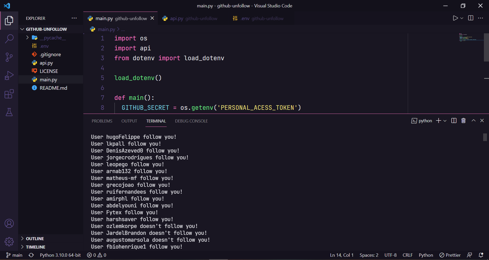

<h1 align="center"> 
  :octocat: GitHub Unfollow
</h1>

<p align="center">
  <a href="https://www.linkedin.com/in/mkiziltay/">
    
  </a>
  
  
  
  <a href="https://github.com/mkiziltay/github-remove-unfollowers/commits/master">
    
  </a>
  
  

  
   <a href="https://github.com/franklaercio/github-unfollow/stargazers">
    
  </a>
</p>

  
  

## :bookmark_tabs: Resume of application

  

Code to unfollow all people don't follow you back. This app was created using [GitHub API](https://docs.github.com/en/rest) and you need to create a token for access GitHub API, check this content on [GitHub Documentation](https://docs.github.com/en/rest/guides/getting-started-with-the-rest-api).

  

<p  align="center">



</p>

  

## 🎲 Running the project

  

```bash

# Clone this repository

$  git  clone  https://github.com/mkiziltay/github-remove-unfollowers

  

# Access the project folder in the terminal/cmd

$  cd  github-unfollow

  

# Create a new env local and adding your prismic url

$  cp  .env.example  .env.local

  

# Run the application

$  python  main.py

```

  

## :books: GitHub Unfollow Configuration

  
*** Firstly use IDE or Command Prompt to run this project.
***  You need python on your computer to run project.
*** You need python-dotenv library (run on console to install it -> pip install python-dotenv)

1. Create a secret for access [GitHub API](https://docs.github.com/en/rest/guides/getting-started-with-the-rest-api)
- You need to have a personel acces token from github settings.
- Settings → Developer settings → Personal access tokens -> [tokens](https://github.com/settings/personal-access-tokens/)
- under token section there is *PERMISSIONS* tab. Add permission for followers and set it *READ and WRITE*

2. Set your user  .env file as shown.
- there is an example .env file on project folder. edit it with text editor.

3. Set time sleep, remember that you can only make 5000 requests.
- You can set it 1 or 2 (second) EXAMPLE: If you have 1000 following and not 200 person not following you = 1210 requests

  

## :man_technologist: Authors

  

*  **MK** - [mkiziltay](https://github.com/mkiziltay)

  

See also the list of [contributors](https://github.com/franklaercio/github-unfollow/contributors) who participated in this project.

  

## :clipboard: License

  

This project is licensed under the MIT License - see the [LICENSE.md](LICENSE.md) file for details

  

## :newspaper: Acknowledgments

  

- Python

- GitHub

- Rest

- API

  

Feito com :hearts: by Frank Laércio :wave:!